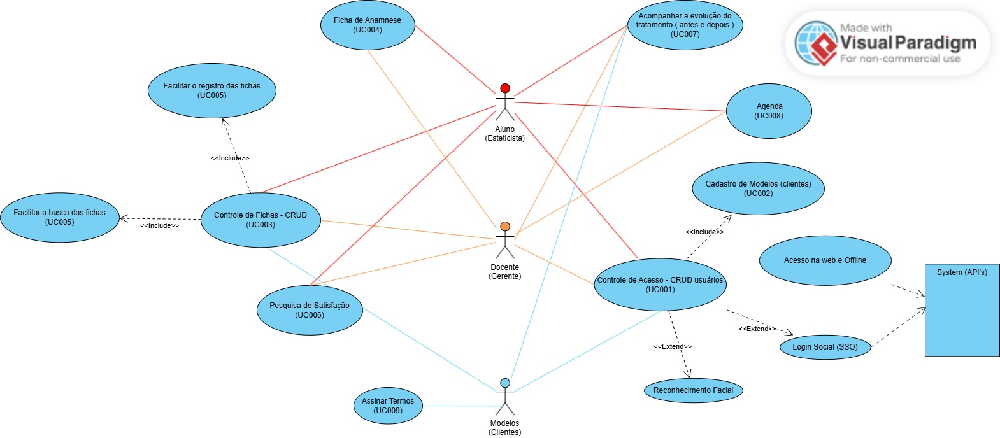

# 🎯 Projetos Estéticas T99

## 📄Informações Gerais

**Projetos:** Sistema de controle para Esteticista

**Versão:** 1.0.0

**Data de Início** 22/07/2025

**Data de Termino (previsto)** 22/08/2025

## 📌 Objetivo do Projeto
Criar um sistema web/mobile de agendamento e controle de clientes e processo para a área de estética.

## Diagramas de UML

### Diagrama De Casos de Uso ( Use Case)

## 📃 Levantamento de Requisitos

|UC # | Descrição | Status | Prioridade | Dificuldade |
|-----|-----|-----|-----|-----|
| RF001 | Controle de Acesso (3) | -| 1 | Complexo - 5ptos |
| RF002 | Cadastro de Modelos - CRUD (3)| - | 1 | Médio - 3ptos |
| RF003 | Manter Fichas - CRUD (3)| - | 2 | Complexo - 5ptos | 
| RF004 | Manter Fichas de Anaminese (3) | - | 1| Médio - 3ptos|
| RNF005 | Facilitar Registro e busca das fichas | - | - | - |
| RF006 | Pesquisa de Satisfação do Cliente | - | 3 | Médio - 3ptos|
| RF007 | Acompanhar tratamento (3) | - | 4 | Médio - 3ptos|
| RF008 | Agendar tratamento | - | 3 | Complexo - 5ptos  |
| RF009 | Assinar aceitar de procedimento (1) | - | 4 | Fácil - 1ptos|
| | | | Total | 30 |
| | | | Total Horas | 30ptos * 4h = 120h |
| | | | Total Horas | 120h * 40,00 = R$ 4800,00|

**Obs:** Usar de 1 a 2 horas por ponto. ( 2h pleno | Jr 4h ).  
valor das horas  : jr R$ 25,00 | pleno R$ 50,00 | senior R$ 80

--
Média de mercado: Salário do Jr R$: 3500,00 / 120h = R$ 30,00/hora 
--
Adicionando a Margem de Lucro = 30,00/hora * 1,3 = 40,00/hora
--
Adiciona se for o caso os Impostos = 40,00 * 1,15

## ✅Tarefas

Tabela de Tarefas
## ✅ Tarefas
 
| A Fazer | Fazendo               | Feito                   |   | 
|---------|---------              |-------                  |----- |
| [] Montar o frond end CTA (Call To Action - chamada à ação)    | |                         ||  
|         | [ ] Montar Wireframe  |                         | |   
|         |                       |[✅] Montar orçamento    | | 
|         |                       |[✅] Montar contrato     | |

## Landing Page  com captação de Leads - R$ 1200,00 á R$ 3500,00

São campos onde os clientes se cadastram para receber desconto, novidades, etc.

## Definir a tecnologia do Sistema
 - Sistema Web R$ 8.000,00 |  App Android  IOs R$ 45.000,00
 - HTML + CSS e JS - frameworks REACT.js | Bulma | Bootstrap
 - PHP + mysql - 10,00/mês | Python com Flask
 - mysql | PostgreSQL | Oracle | DBII

## Comandos Docker Compose
| Descrição | Comando |
|----------|----------|
|Criar e Startar os containers | `docker compose up -d --build` |
| Parar containers | `docker stop numeroContainer`|
| Remover o Container | `docker rm numeroContainer`|
| Ver os containers | `docker ps -a`|
| Acessando o terminal do container | `docker compose run nome/ID bash`|
| Instala pacotes no Alpine | `apk add nome` |
|**Comando do Compose**| |
| Executando o composer | `docker compose exec web composer --version`|
| Criando o projeto Laravel | `docker compose exec web composer create-project laravel/laravel .`|
| Descobrir seu ID | `echo $UID ou id -u`|
| Descobrir o ID GID | `echo $GID` ou `grp -u`|
| Descobrir o ID GID | `echo $GID` ou `id -g`|
| Criar uma variavel de ambiente | `export UID=(id -u)`|
| Criar uma variavel de ambiente grupo | `export GID=(id -g)`|

## Algoritmo - coleta de e-mail (leads)
- Preencha o campo e-mail (obrigatório)
- Confirmar a aceitação dos termos (obrigatório)
- Envia os dados para o PHP
- PHP cadastra no DB

 
 